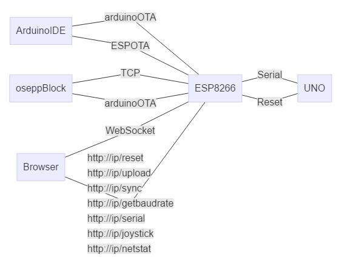

# esp8266 Uno Wifi

This project runs on esp8266 and provides serial bridge services for uno,The first time you need to use the serial port to upload the sketch to esp8266.Then you can use WIFI SerialPort like using USB

you can:

+ OTA(over the air) upload new sketch to esp8266
+ OTA(over the air) upload new sketch to UNO(without manual reset uno)
+ Access the serial port of the uno through web browser
+ Access uno serial port via TCP
+ Configuring access points and wifi using web browser
+ TCP channel(oseppBlock) and up to five WebSocket connections(Browser) receive data at the same time from the uno serial port
+ Control your robot using a web browser on any device anywhere


ESP8266 will have two IP addresses,depending on your network connection
If your esp8266 is connected to the router and your device is also connected to the router, then you should access it with the IP address assigned by the router to ESP8266. The format of the IP address is usually 192.168.1.?
If your device accesses ESP8266's WIFI access point then you should use 192.168.4.1 to access it
No matter how you connect, they are all equivalent



<!-- @import "[TOC]" {cmd="toc" depthFrom=1 depthTo=6 orderedList=false} -->

<!-- code_chunk_output -->

- [esp8266 Uno Wifi](#esp8266-uno-wifi)
    - [1. setup esp8266](#1-setup-esp8266)
    - [2. setup Access point & connect to your router](#2-setup-access-point--connect-to-your-router)
    - [3. Connect esp8266 to uno](#3-connect-esp8266-to-uno)
    - [4. upload sketch to uno via OTA](#4-upload-sketch-to-uno-via-ota)
    - [5. upload sketch to esp8266(esp-01s) via OTA](#5-upload-sketch-to-esp8266esp-01s-via-ota)
    - [6. Web browser Serial monitor](#6-web-browser-serial-monitor)
    - [7. Using arduinoOTA and TCP Serial Monitors in oseppBlock](#7-using-arduinoota-and-tcp-serial-monitors-in-oseppblock)
    - [8. Virtual Joystick](#8-virtual-joystick)

<!-- /code_chunk_output -->

---

## 1. setup esp8266

+ Load sketch **EspUnoWifi.ino** using arduino IDE
+ [install ESP8266 into your Arduino IDE](http://esp8266.github.io/Arduino/versions/2.0.0/doc/installing.html)
+ install[arduinoWebSockets](https://github.com/Links2004/arduinoWebSockets)Arduino Libraries  
 Sketch -> Include Library -> Manage Libraries  
 Search websockets and install **WebSockets by Markus Sattler**  
 *[How to Install a Library](https://www.arduino.cc/en/guide/libraries)*
+ Set your router SSID and password in the sketch(*You can skip this step and then setting it in web browser*)  
 `const char default_router_ssid[] = "YourRouterSSID";//your router ssid`  
 `const char default_router_pswd[] = "YourRouterPassword";//your router password`
+ Click Verify on Arduino IDE,Make sure you see **done compiling**, then continue
+ upload this project to ESP8266 via Serial port
 You need a UNO, don't switch on the power first,Connect them like this

    | ESP-01S | UNO         |
    | :-----: | :---------: |
    | RX      | RX          |
    | TX      | TX          |
    | IO0     | GND         |
    | GND     | GND         |
    | 3V3     | 3V3         |
    |         | Reset-->GND |
    
    Now connect UNO and computer via USB.Since we connect UNO's Reset to GND, UNO is now bypassed.Esp-01's IO0 is connected to GND, so ESP01 enters the bootloader,use arduino IDE to upload the program will enter esp-01  
  + Tool->Board->**Generic ESP8266 Module**
  + Tool->Flash Size->**1M(no SPIFFS)**
  + Tool->Port->**your serial com port**
  + click **upload**
  + If you fail, it may be that esp8266 does not enter bootloader mode, unplug the USB, inserts it again after about 10 seconds, and then uploads

## 2. setup Access point & connect to your router

If you have already set the router SSID and password in step 1, you can skip this step

+ Connect the power supply for ESP8266
+ Log in to the access point **WIFI-ESP-SERIAL-xxxxxx** with any wifi-capable device and use the password **oseppesp**
+ Use a web browser to open URL: <http://192.168.4.1/netstat>
+ Select **your router access point** at `WIFI SSID` and fill your router  password in `WIFI Password` and chick nearby **update** button,esp8266 will restart so you will lose wifi connection,Wait a moment then re-Connect to the access point open URL: <http://192.168.4.1/netstat> again.For unknown reasons, usually you will see the IP address is 0.0.0.0, then you need to manually reset the ESP8266 to make it connect to the route correctly...
+ If ESP8266 has successfully connected to your router then it will show an IP address at the bottom of the page.
+ Set a new esp8266 access point name and password for security,Fill in **AP SSID**, and **AP PSWD**,Password is at least 8 letters or it will not work,Click nearby **update** button.
 

## 3. Connect esp8266 to uno

| ESP-01s | uno   |
| ------: | ----- |
| RX      | TX    |
| TX      | RX    |
| 3V3     | 3v3   |
| GND     | GND   |
| IO2     | reset |

| Nodemcu | uno   |
| ------: | ----- |
| RX      | TX    |
| TX      | RX    |
| VIN     | 5V    |
| GND     | GND   |
| D4      | reset |

## 4. upload sketch to uno via OTA

+ Tool->Board->**Arduino Uno WiFi**
 *You can't use `Uno WiFi` features just to be able to use arduino OTA*
+ Tool->Port->Network ports->**your network device**
+ click **upload**
+ If you see the following text, the upload was successful
    > Resetting the board  
Waiting for the upload to start  
OSEPP Esp8266 for UnoOTA, SYNC OK!184705  
Uploading the sketch  
Upload done! Flash used:2806 bytes  
Sketch uploaded successfully  
Resetting the board


## 5. upload sketch to esp8266(esp-01s) via OTA

+ Tool->Board->**Generic ESP8266 Module**
+ Tool->Flash Size->**1M(no SPIFFS)**
+ Tool->Port->Network ports->**network device**
+ click **upload**
+ 

## 6. Web browser Serial monitor

+ Open the URL in web browser:`http://[esp8266 ip you see in port list or 192.168.4.1]?baudrate=115200`
  *note:You can specify the baud rate of the serial port by appending **?baudrate=nnnnn** to any url.*
+ Upload a sketch with serial output to UNO,[according to #4](#4-upload-sketch-to-uno-via-ota)

```arduino
void setup() {
  // put your setup code here, to run once:
  Serial.begin(115200);
}

void loop() {
  // put your main code here, to run repeatedly:
  Serial.println(millis());
  delay(1000);
}
```

+ You will see the serial data displayed in the web browser
+ You can try to send msg to uno, reset uno
+ 

## 7. Using arduinoOTA and TCP Serial Monitors in oseppBlock

+ Select the network device in the port list, or fill in the IP address.
+ Click on the upload icon to upload the sketch to UNO via OTA
+ Click on the connection icon, you can see the following window, the same as the USB connection


## 8. Virtual Joystick

+ Open `http://[esp8266 ip address]/joy` in web browser *phone, ipad, computer, any browser supporting HTML5*
+ Add `?baudrate=nnnnnn` at the end of the URL to set the baud rate you want like `http://192.168.0.88/joy?baudrate=115200`
+ Use mouse, or touch the screen with your finger and drag, support multi-touch (2 points)
+ In oseppBlock, you can use Block  
 **Remote [Joy Channel]**  
 **Remote Timeout[*]**  
 To receive data and processing
+ In the Arduino IDE, you can use our OseppRemote library


